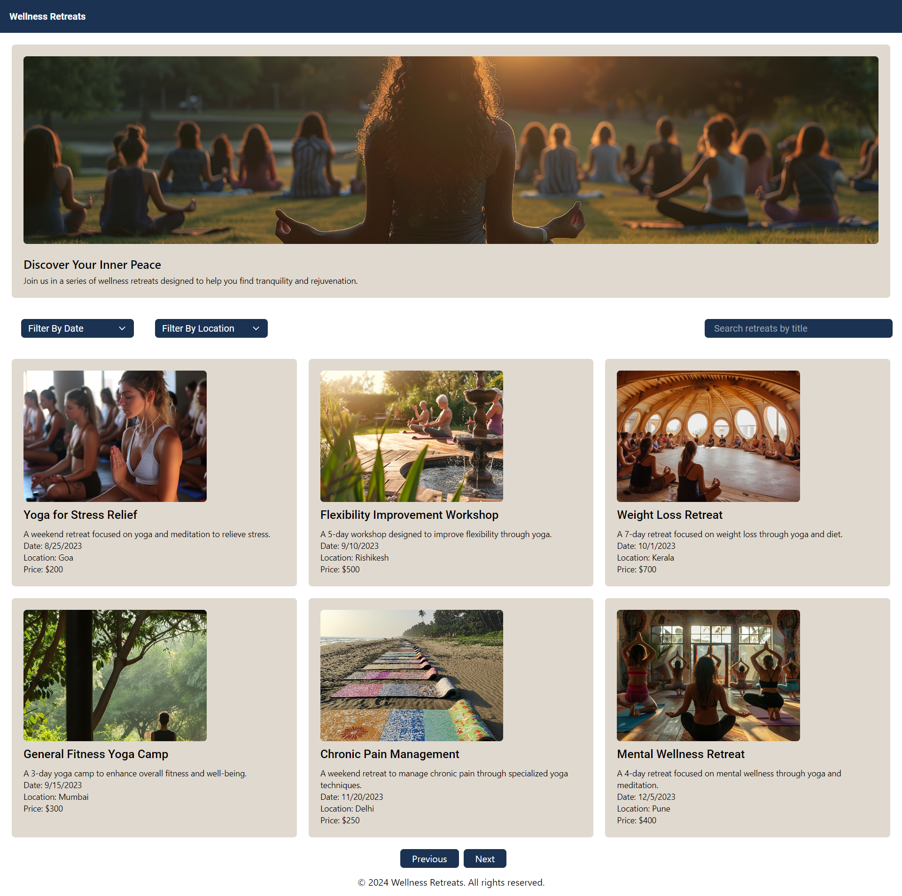
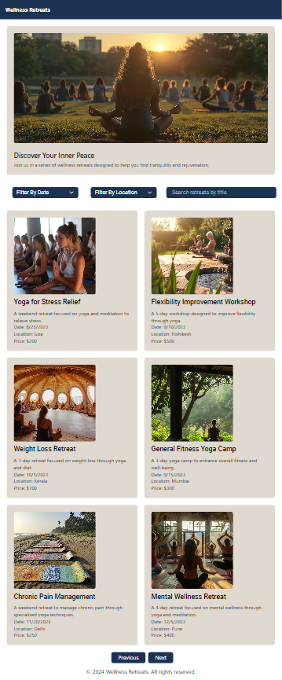
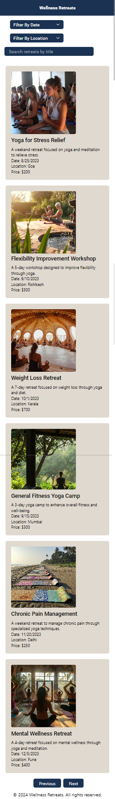

# Wellness Retreats 🔥

## Project Setup 🎉

To get your project up and running, you'll need to install all the necessary npm packages. Please ensure you're connected to the internet, as we'll be downloading these packages. Here are the steps to follow:

## `Step-1`

#### Open your terminal and navigate to your project directory.

#### Run the following command to install all required npm packages.

```
npm install
```

This command will read the package.json file in your project and install all the dependencies listed there. Once the installation is complete, you'll have all the packages needed to run your project successfully.

## `Step-2`

You need to run a command in your terminal to start the application. Make sure you are in the root directory of your project. Use the following command:

```
npm run start
```

This command will start your application on a local server, meaning it will run on your computer.

## `Step-3`

Now, you'll receive two links. You need to copy the local URL or use Ctrl + Left Click on it, which will open the application in your browser

```
Local:            http://localhost:3000
On Your Network: http://192.168.218.96:3000
```

# Live Demo 🚀

Check out the live version of the app: [https://wellness-retrets.vercel.app/](https://wellness-retrets.vercel.app/)

## Responsiveness of project 🔥



## Tablet Screen



## Mobile Screen


